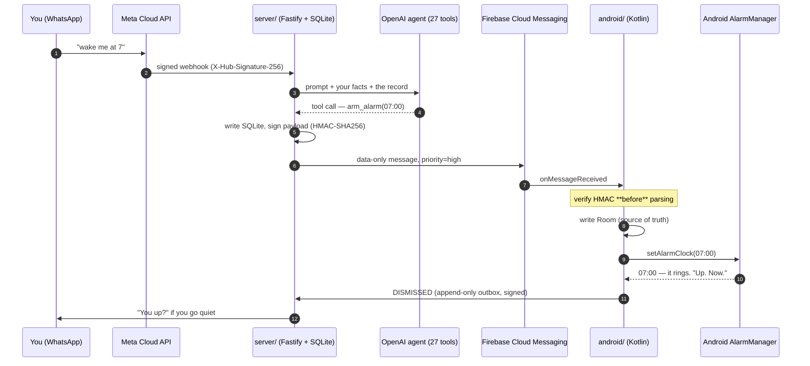

<!-- markdownlint-disable MD033 -->
<h1 align="center">Otto</h1>

<p align="center">
  <strong>A personal AI assistant that lives in WhatsApp and can actually wake you up.</strong>
</p>

<p align="center">
  
  
  
  
  
</p>

---

You text Otto like a person. It sets alarms that ring properly, chases you until things
are actually done, works out when you need to leave, and tells you the truth about how
often you've moved that one task.

It runs entirely on your own infrastructure. There is no Otto service, no account to sign
up for, and nobody else's server in the loop.

## The pitch, in one screenshot's worth of text

> **you** — wake me at 7
>
> **Otto** — Set. 07:00 tomorrow.
>
> *…the next morning, the phone rings at full volume, screen on, over the lockscreen:*
> **"Up. Now."** with two buttons — **I'm up** and **9 more minutes**.
>
> *…you tap "I'm up", then go back to sleep. Twelve minutes later:*
>
> **Otto** — You up?
>
> **Otto** *(ten minutes after that)* — Still nothing. Are you up?
>
> **Otto** *(ten more)* — Wake up was half an hour ago and you've gone quiet. Last ask before
> I ring the phone again.

And later that week:

> **you** — remind me to take the bins out tonight
>
> **Otto** — Got it.
>
> *…that evening, a notification you can action from the lockscreen without unlocking:*
> **"Still need to take the bins out? Say done when it's sorted."** — with a **Done** button.
>
> *…you ignore it. Twice.*
>
> **Otto** — Second time asking.

> **you** — I'm going to the dentist at 3
>
> **Otto** — 40 minutes on the tube, leave at 14:20. I'll ring you then.

Otto is blunt on purpose. It's a coach, not a butler — and its sharpness is a function of
your actual record, read out of the database, not a mood the model invented. It also knows
when to drop it entirely:

> *from the persona, verbatim:* "Read what the thing actually is before you sharpen a line.
> Anything touching health, a death, money trouble, a family emergency, or something they
> have told you is hard: drop the edge completely. **Bins are fair game. A biopsy is not.**"

## Why this exists

Otto is a scheduling agent, and scheduling agents are easy right up until the moment
something has to actually happen.

> **A server cannot ring a phone.**
>
> Calendar events and reminders sync or arrive over WhatsApp without any app on the device.
> A true alarm — loud, full-screen, dismiss-to-stop, works in Doze, survives a reboot — must
> be scheduled by code running on the phone. The companion app is that code.

So Otto is two halves that only work together:

- **`server/`** — the brain. Receives your WhatsApp messages, runs an AI agent with 27 tools,
  decides what should happen and when, and pushes absolute instructions to the phone.
- **`android/`** — the hands. Never decides anything. It receives *"arm alarm X at epoch T"*
  and makes the phone ring, reliably, even in Doze, locked, or after a reboot.

That boundary is deliberate: all the reasoning stays on the server, where it can change
without shipping a new APK.

## What it can do

| | |
|---|---|
| **Alarms that mean it** | Full volume with a ramp, over the lockscreen, screen on, through Do Not Disturb, surviving reboots, timezone changes and force-stop recovery. Repeating alarms too — *"wake me every weekday at 7"*. |
| **Reminders that chase** | Twelve hand-written escalation ladders (3 timing kinds × 4 intensities, from `gentle` to `relentless`). Otto knows the difference between *"get it done **by** 4"*, *"the dentist is **at** 4"*, and *"remind me **at** 4"* — and nags differently for each. |
| **Nudges you can action from the lockscreen** | Three graded notification tiers, with **Done** and **Snooze** buttons that work without unlocking the phone. Plus one persistent, silent "3 things open" line in your shade. |
| **Leave-by alarms** | *"I'm going to Mum's Saturday lunchtime"* → looks the place up, prices the journey with live traffic, creates the calendar event, and rings you at **leaving** time, not event time. It re-checks 45 minutes before departure in case traffic moved. |
| **Knows your places** | "the gym", "mum's", "the dentist" — saved silently the first time, never asked about again. |
| **Google Calendar & Tasks** | Reads your day for the morning brief, and creates, moves and cancels events. *"Plan my day"* lays a whole set of blocks around what is already on it, in one call, never over a real meeting. |
| **Voice notes and photos** | Voice notes are transcribed and acted on. A photo is something to act on, not to narrate back at you. |
| **Briefs and a weekly review** | A morning brief that has to earn the interruption, an optional evening one, and a Sunday review that leads with what actually happened. |
| **Location, only when it predicts something** | Otto can ask your phone where it is — **once, when asked**, never continuously — to price a journey properly. Every single fix posts a visible notification saying it happened and what for. |
| **Quiet hours** | Nothing proactive between 22:00–07:00 by default, with four documented exemptions — all of which the calendar rule below then overrides. It also learns the hours you actually keep — *"'first thing' for someone up at two in the afternoon means two in the afternoon"*. |
| **Silent while you're booked** | Otto does not speak first while you are in a meeting, a dinner or an appointment. What he would have said is dropped, not saved up for the moment you walk out. Anything due while you were booked is assumed to have happened and closed — you never have to interrupt a meeting to tell Otto you're in it. Your alarms and leave-by alarms still ring. |

## How it works



## Can I actually run this?

**Yes — but let's be honest about it.** This is not `docker run`. It's a self-hosted personal
assistant wired into four external services, and one of them is Meta's WhatsApp Business API.

**Realistically: 3–6 hours for your first successful ring, and under $10/month to run.**

Set it up in levels. Each one works on its own, and you can stop at any of them.

### 🟢 Level 1 — a phone that rings (~45 min, free)

Firebase project → run the server locally → build the app → pair → `curl` an alarm onto your
phone and watch it go off. **This is the whole reliability engine**, and it works with no AI,
no WhatsApp and no hosting bill.

### 🟡 Level 2 — an actual assistant (+1–2 hours, a few $/month)

Add an OpenAI key and a public HTTPS host, then connect WhatsApp. **The Meta step is the
hardest part of this entire project** — a Business-type app, a System User with a permanent
token, webhook verification, and subscribing to the `messages` field. The free test number can
only message a handful of pre-registered recipients; a real number needs business verification.

### 🔵 Level 3 — the full thing (+30–60 min)

Google Calendar/Tasks OAuth, Google Maps for real travel times, and Groq for voice notes.

### What it costs

| | |
|---|---|
| Firebase / FCM | **Free** — the Spark tier is plenty |
| OpenAI | A few dollars a month for one person. Prompt-cache layout is load-bearing here and is treated as architecture, not an optimisation |
| Hosting | ~$2–5/month. **It cannot scale to zero** — the scheduler runs in-process, and a stopped machine misses alarms |
| WhatsApp | Free for service conversations. Otto is designed so you never need a paid template |
| Google Calendar / Tasks | Free |
| Google Maps | Free allowance covers one person. Otto self-caps at 40 route + 15 place lookups per day anyway |
| Groq (voice notes) | Optional, free tier |

### Things this README will not pretend

- **Android only, sideload only.** Never published to Play — several restricted permissions are
  used precisely *because* it's sideloaded.
- **You must build the app yourself.** There's no downloadable APK and there can't be: Firebase
  binds to your project at build time, and that binding is what connects *your* server to *your*
  phone. Android Studio is a hard prerequisite.
- **Force-stopping the app breaks alarms.** That's Android, not a bug — the OS cancels pending
  alarms and stops push delivery until next launch. Otto detects it, warns you, and recovers on
  open, but it cannot prevent it.
- **Aggressive OEM battery managers** (Samsung, Xiaomi, et al.) can kill the alarm path even when
  every permission reads as granted. Grant the battery-optimisation exemption.
- **Direct-boot isn't solved.** After an *unattended* reboot that sits locked past an alarm time,
  alarms re-arm at first unlock. A phone unlocked before the alarm time is unaffected.
- **It's built for one person.** Everything is keyed by `deviceId` so more devices could pair, but
  the assumption throughout is one owner and their phone.

## Get started

| | |
|---|---|
| 🚀 **[server/SETUP.md](server/SETUP.md)** | **Start here.** The full walkthrough: Firebase, OpenAI, hosting, pairing, WhatsApp, Calendar, Maps. Twelve numbered sections, and it documents the failure modes, not just the happy path. |
| 📱 **[docs/BUILDING-THE-APP.md](docs/BUILDING-THE-APP.md)** | The phone half: Android Studio, your `google-services.json`, building, sideloading, and the permission walkthrough. |
| 🧪 **[docs/manual-testing.md](docs/manual-testing.md)** | The device tests you can't automate — does it really ring with the screen off and locked? |

## The engineering, for people who like that sort of thing

This is a project about one thing being reliable, and most of the interesting decisions come
from that. A few worth a look:

- **Verify before parse.** The FCM HMAC is checked *before* the payload is parsed
  ([`OttoFcmService.kt`](android/app/src/main/java/com/otto/app/push/OttoFcmService.kt)). The
  rejection path emits an authenticated request, so parsing first would let anyone holding the
  push token use your phone as a probing oracle — and, since location landed, ask it where you are.
- **SYNC fails safe.** An earlier version collapsed "empty response", "unparseable response" and
  "genuinely no alarms" into one action: cancel everything. A transient hiccup could silently
  delete your alarms. [`SyncReconciler.kt`](android/app/src/main/java/com/otto/app/net/SyncReconciler.kt)
  is now a pure function that only lets a present, non-empty, authoritative list cancel anything.
- **Room is the source of truth.** AlarmManager is derived state, rebuildable from the database on
  boot, app update or force-stop recovery. If they disagree, Room wins.
- **Append-only outboxes, drained in order.** Events are appended, not read from current state, so
  `SNOOZED` and every intermediate transition reaches the server. The drain stops at the first
  failure, because the server's RANG/DISMISSED signal is order-sensitive.
- **"Otto keeps no location history" is true by construction.** A location request survives process
  death in WorkManager's own `Data` bundle — deliberately *no* database change. There is nothing to
  replay and nothing to delete. And a fix is never retried, only re-taken: a late nudge is still
  true, a late location is simply wrong.
- **The nudge path is a separate stack, all the way down.** Its own scheduler interface, receivers,
  intent actions and request-code band. Widening the alarm scheduler to serve a nudge is the most
  likely way to regress the one thing this app must never get wrong.
- **Prompt-cache layout is the architecture.** A per-second timestamp near the top of the prompt
  doesn't uncache one block — it moves the first differing byte to the front and throws away the
  cache for the entire request, tools and all. One line was the difference between ~$90/month and
  ~$25/month, so the tool list is a frozen, deterministic array with a test pinning its order.
- **Structural rules beat instructions.** The weekly review filters its "still sitting there" list
  on `state = 'OPEN'` in SQL rather than asking the model not to mention finished work. *Being
  unable to say it is stronger than being told not to.*
- **"Don't interrupt a meeting" is three gates, not a paragraph in the prompt.** The rung is held in
  `runNudge` before the claim so it costs no rung, the row is retired in `flushOutbox`, and the
  wake-check stands down at its source. The prompt only *describes* what the code already
  guarantees. It fails **open** on purpose: an unreachable calendar means Otto speaks, because an
  assistant that goes permanently silent the day a refresh token expires is the worse failure.
- **Everything fails soft to a template.** No API key, a timeout, a 429 — every surface degrades to
  a deterministic string. Nudges fire at 3am on a machine that may have no working credentials, and
  a nudge that doesn't send is worse than one that reads like a template.

The commit history is worth a browse too. It reads like a changelog written by someone who was
there: *"Give the phone a voice quieter than an alarm"*, *"Stop mid-ring re-arm from orphaning the
ring or corrupting the new alarm"*, *"Make alarms actually loud"*.

## Layout

```
├── android/          Kotlin · Compose · Hilt · Room · WorkManager
│   ├── app/          the app itself
│   ├── tools/        a Node helper for sending test pushes by hand
│   ├── spec.md       the full technical spec (§1–17)
│   └── CLAUDE.md     architecture notes and hard-won platform gotchas
├── server/           TypeScript · Fastify · SQLite/Drizzle · OpenAI Responses API
│   ├── src/agent/    persona, prompt assembly, 27 tools
│   ├── src/fcm/      command builders + HMAC signer
│   ├── SETUP.md      the end-to-end setup walkthrough
│   └── .env.example  every environment variable, documented
└── docs/             building the app, manual device tests
```

## Status

Both halves are complete and build-verified. The app is at **1.2.0** (`versionCode 3`), all seven
milestones done: alarm spine → server sync → ring experience → reliability hardening → polish →
the nudge tier → location on demand.

- **Android:** Kotlin/Compose, `minSdk 26`, `compileSdk`/`targetSdk 36`, Room schema v3.
  **121 unit tests** plus migration tests that run on a real device.
- **Server:** Node 20+, TypeScript, Fastify 5, SQLite via Drizzle, OpenAI Responses API.
  **874 tests across 53 files.** The suite is hermetic — it deliberately runs with no API key, so
  every model-backed surface exercises its deterministic fallback on every run.
- **Seven FCM command types**, one versioned contract, pinned end-to-end by a contract test that
  holds payloads the server actually produced — signature included — because nothing at build time
  checks one half against the other.

Known deferred work: R8 minification, certificate pinning, direct-boot alarm survival, and two
instrumentation suites that would need a real device and a Hilt test scaffold that doesn't exist
yet. All four are documented rather than hidden.

## Contributing

See [CONTRIBUTING.md](CONTRIBUTING.md). Short version: this is one person's assistant that happens
to be open source. Issues and PRs are welcome, nothing is promised, and if you fork it and make it
yours, that's the best possible outcome.

## License

[MIT](LICENSE). Do what you like with it.
